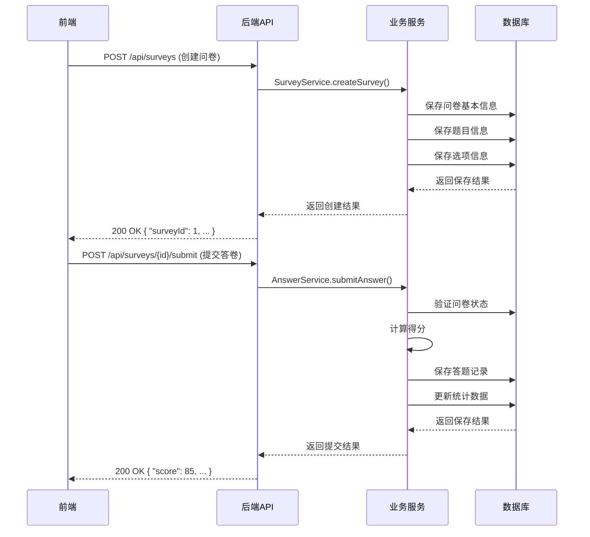
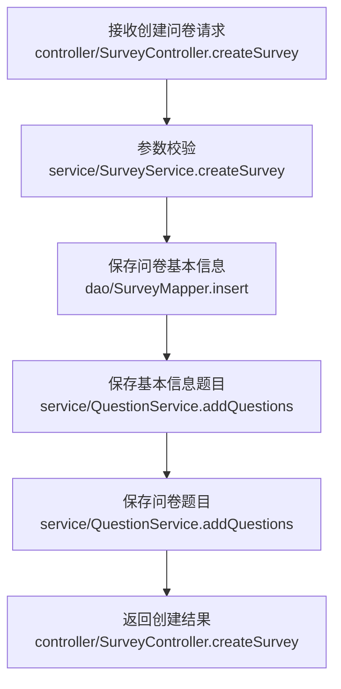
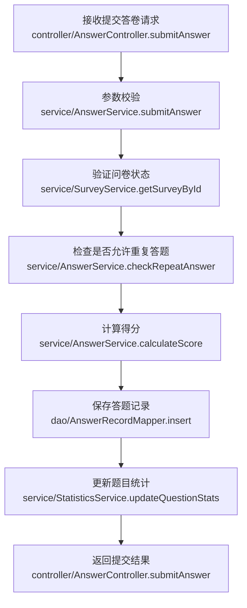
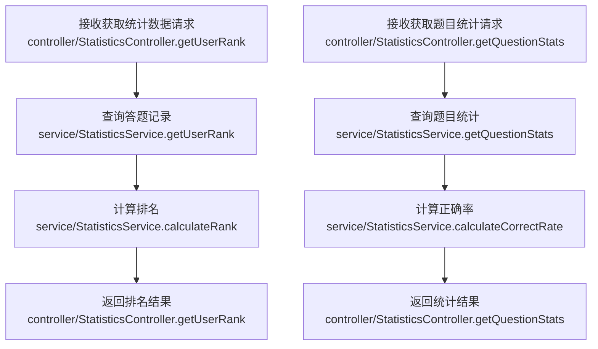
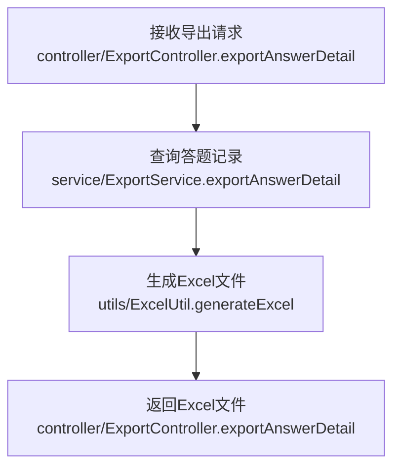

# 问卷系统后端技术方案

## 1. 仓库分析

通过分析前端仓库代码，我们可以看到这是一个问卷管理系统，主要功能包括：

### 1.1 核心功能
- **问卷管理**：创建、编辑、发布问卷
- **题目管理**：支持添加、编辑、删除题目，包括单选题、多选题、输入框类型
- **答题设置**：设置答题开始/结束时间、是否允许重复答题、答题时间限制
- **答题统计**：用户排名、题目统计（正确率、选项分析等）
- **数据导出**：支持导出答题明细、用户排名、题目统计等数据

### 1.2 数据结构
从前端代码中，我们可以提取出以下核心数据结构：

1. **问卷(Survey)**：
   - 标题(surveyTitle)
   - 基本信息题目(basicQuestions)
   - 问卷题目(questionQuestions)
   - 发布设置(settings)：开始时间、结束时间、是否允许重复答题、时间限制

2. **题目(Question)**：
   - ID(id)
   - 类型(type)：single(单选)、multiple(多选)、input(输入框)
   - 题目内容(text)
   - 是否必填(required)
   - 选项(options)：仅适用于选择题
   - 正确答案：
     - 单选题：correctOption(正确选项索引)
     - 多选题：correctOptions(正确选项索引数组)
     - 输入框：correctAnswer(正确答案文本)
   - 分值(score)：仅适用于问卷题目

3. **选项(Option)**：
   - 选项内容(text)
   - 是否正确(isCorrect)

4. **答题记录**：
   - 用户信息(name)
   - 答对题数(correctCount)
   - 得分(score)
   - 提交时间(submitTime)

5. **统计数据**：
   - 用户排名(userRank)
   - 题目统计(questionStats)：总答题人数、答对数量、答错数量、正确率、选项分析

## 2. 后端系统技术方案

### 2.1. 技术选型

| 分类 | 技术 | 版本 | 选型理由 |
| :--- | :--- | :--- | :--- |
| 语言 | Java | 17 | 编译型语言，性能优异，生态成熟，适合高并发后端服务。 |
| 框架 | Spring Boot | 3.2.0 | 快速构建应用，内嵌容器，自动配置，简化开发。 |
| 数据库 | MySQL | 8.0 | 关系型数据库，稳定可靠，适合存储结构化数据，生态成熟。 |
| 缓存 | Redis | 7.0+ | 用于缓存热点数据和管理Session/Token。 |
| 认证 | JWT | - | 无状态认证，便于水平扩展。 |
| ORM | MyBatis-Plus | 3.5.5 | 简化数据库操作，提供CRUD操作，支持Lambda表达式。 |
| 工具库 | Apache POI | 5.2.5 | 用于Excel文件的导入导出。 |
| 工具库 | EasyExcel | 3.3.4 | 更高效的Excel处理，内存占用低。 |
| 工具库 | Lombok | 1.18.30 | 简化代码，减少样板代码。 |
| API文档 | Swagger | 3.0.0 | 自动生成API文档，便于前端对接。 |

### 2.2. 关键设计

#### 2.2.1. 架构设计
- **架构风格**: 集成式单体应用 (Integrated Monolith)。后端逻辑作为独立模块，与前端通过API交互。
- **模块划分**:
  - `survey-system-backend`：主应用
    - `src/main/java/com/survey/system/controller`：控制器层，处理HTTP请求
    - `src/main/java/com/survey/system/service`：服务层，处理业务逻辑
    - `src/main/java/com/survey/system/dao`：数据访问层，处理数据库操作
    - `src/main/java/com/survey/system/model`：数据模型层，定义实体类
    - `src/main/java/com/survey/system/dto`：数据传输对象，定义请求和响应结构
    - `src/main/java/com/survey/system/config`：配置类
    - `src/main/java/com/survey/system/utils`：工具类

- **核心流程图**:



#### 2.2.2. 目录结构

```plaintext
survey-system-backend/       # 后端应用
├── src/
│   ├── main/
│   │   ├── java/com/survey/system/
│   │   │   ├── controller/       # 控制器
│   │   │   │   ├── SurveyController.java
│   │   │   │   ├── QuestionController.java
│   │   │   │   ├── AnswerController.java
│   │   │   │   ├── StatisticsController.java
│   │   │   │   └── ExportController.java
│   │   │   ├── service/          # 服务
│   │   │   │   ├── SurveyService.java
│   │   │   │   ├── QuestionService.java
│   │   │   │   ├── AnswerService.java
│   │   │   │   ├── StatisticsService.java
│   │   │   │   └── ExportService.java
│   │   │   ├── dao/              # 数据访问
│   │   │   │   ├── SurveyMapper.java
│   │   │   │   ├── QuestionMapper.java
│   │   │   │   ├── OptionMapper.java
│   │   │   │   ├── AnswerRecordMapper.java
│   │   │   │   └── StatisticsMapper.java
│   │   │   ├── model/            # 数据模型
│   │   │   │   ├── Survey.java
│   │   │   │   ├── Question.java
│   │   │   │   ├── Option.java
│   │   │   │   ├── AnswerRecord.java
│   │   │   │   └── Statistics.java
│   │   │   ├── dto/              # 数据传输对象
│   │   │   │   ├── SurveyDTO.java
│   │   │   │   ├── QuestionDTO.java
│   │   │   │   ├── AnswerSubmitDTO.java
│   │   │   │   ├── StatisticsDTO.java
│   │   │   │   └── UserRankDTO.java
│   │   │   ├── config/           # 配置
│   │   │   │   ├── MyBatisPlusConfig.java
│   │   │   │   ├── RedisConfig.java
│   │   │   │   └── SwaggerConfig.java
│   │   │   └── utils/            # 工具
│   │   │       ├── ExcelUtil.java
│   │   │       └── JwtUtil.java
│   │   └── resources/
│   │       ├── application.yml   # 应用配置
│   │       └── mapper/           # MyBatis映射文件
│   └── test/                     # 测试
├── pom.xml                       # Maven配置
└── README.md                     # 项目说明
```

* 说明：
  * `controller/`（新增）：处理HTTP请求，调用服务层方法，返回响应。
  * `service/`（新增）：实现业务逻辑，调用数据访问层方法。
  * `dao/`（新增）：定义数据访问接口，使用MyBatis-Plus实现。
  * `model/`（新增）：定义数据库实体类，对应数据库表结构。
  * `dto/`（新增）：定义请求和响应的数据结构，与前端交互。
  * `config/`（新增）：配置类，包括MyBatis-Plus、Redis、Swagger等配置。
  * `utils/`（新增）：工具类，包括Excel处理、JWT工具等。

#### 2.2.3. 关键类与函数设计

| 类/函数名 | 说明 | 参数（类型/含义） | 成功返回结构/类型 | 失败返回结构/类型 | 所属文件/模块 | 溯源 |
|----------|------|-----------------|----------------|-----------------|-------------|------|
| `SurveyService.createSurvey()` | 创建问卷 | surveyDTO: SurveyDTO 问卷信息 | `{"surveyId": Long, "title": String, ...}` | `{"code": Integer, "message": String}` | service/SurveyService.java | App.vue:667-669 |
| `SurveyService.updateSurvey()` | 更新问卷 | id: Long 问卷ID<br>surveyDTO: SurveyDTO 问卷信息 | `{"surveyId": Long, "title": String, ...}` | `{"code": Integer, "message": String}` | service/SurveyService.java | App.vue:667-669 |
| `SurveyService.publishSurvey()` | 发布问卷 | id: Long 问卷ID | `{"success": Boolean, "message": String}` | `{"code": Integer, "message": String}` | service/SurveyService.java | App.vue:346-349 |
| `QuestionService.addQuestion()` | 添加题目 | surveyId: Long 问卷ID<br>questionDTO: QuestionDTO 题目信息 | `{"questionId": Long, "text": String, ...}` | `{"code": Integer, "message": String}` | service/QuestionService.java | App.vue:509-633 |
| `QuestionService.updateQuestion()` | 更新题目 | id: Long 题目ID<br>questionDTO: QuestionDTO 题目信息 | `{"questionId": Long, "text": String, ...}` | `{"code": Integer, "message": String}` | service/QuestionService.java | App.vue:778-868 |
| `QuestionService.deleteQuestion()` | 删除题目 | id: Long 题目ID | `{"success": Boolean, "message": String}` | `{"code": Integer, "message": String}` | service/QuestionService.java | App.vue:384-392 |
| `AnswerService.submitAnswer()` | 提交答卷 | surveyId: Long 问卷ID<br>answerSubmitDTO: AnswerSubmitDTO 答卷信息 | `{"score": Double, "correctCount": Integer, ...}` | `{"code": Integer, "message": String}` | service/AnswerService.java | App.vue:361-364 |
| `StatisticsService.getUserRank()` | 获取用户排名 | surveyId: Long 问卷ID | `List<UserRankDTO>` | `{"code": Integer, "message": String}` | service/StatisticsService.java | App.vue:111-117 |
| `StatisticsService.getQuestionStats()` | 获取题目统计 | surveyId: Long 问卷ID | `List<QuestionStatsDTO>` | `{"code": Integer, "message": String}` | service/StatisticsService.java | App.vue:118-149 |
| `ExportService.exportAnswerDetail()` | 导出答题明细 | surveyId: Long 问卷ID | `ByteArrayResource` Excel文件 | `{"code": Integer, "message": String}` | service/ExportService.java | App.vue:351-354 |
| `ExportService.exportUserRank()` | 导出用户排名 | surveyId: Long 问卷ID | `ByteArrayResource` Excel文件 | `{"code": Integer, "message": String}` | service/ExportService.java | App.vue:351-354 |
| `ExportService.exportQuestionStats()` | 导出题目统计 | surveyId: Long 问卷ID | `ByteArrayResource` Excel文件 | `{"code": Integer, "message": String}` | service/ExportService.java | App.vue:351-354 |

**数据传输对象(DTO)结构**：

| 字段名 | 类型 | 含义 | 约束 | 所属文件/模块 | 溯源 |
|-------|------|------|------|-------------|------|
| `SurveyDTO.title` | String | 问卷标题 | 非空 | dto/SurveyDTO.java | App.vue:6 |
| `SurveyDTO.basicQuestions` | List<QuestionDTO> | 基本信息题目 | 可空 | dto/SurveyDTO.java | App.vue:9-23 |
| `SurveyDTO.questionQuestions` | List<QuestionDTO> | 问卷题目 | 可空 | dto/SurveyDTO.java | App.vue:26-53 |
| `SurveyDTO.settings` | SurveySettingsDTO | 发布设置 | 非空 | dto/SurveyDTO.java | App.vue:103-108 |
| `SurveySettingsDTO.startTime` | LocalDateTime | 开始时间 | 非空 | dto/SurveyDTO.java | App.vue:104 |
| `SurveySettingsDTO.endTime` | LocalDateTime | 结束时间 | 非空 | dto/SurveyDTO.java | App.vue:105 |
| `SurveySettingsDTO.allowRepeat` | Boolean | 是否允许重复答题 | 非空 | dto/SurveyDTO.java | App.vue:106 |
| `SurveySettingsDTO.timeLimit` | Integer | 答题时间限制(分钟) | 非空 | dto/SurveyDTO.java | App.vue:107 |
| `QuestionDTO.type` | String | 题目类型 | 非空 | dto/QuestionDTO.java | App.vue:12,29,43 |
| `QuestionDTO.text` | String | 题目内容 | 非空 | dto/QuestionDTO.java | App.vue:13,30,44 |
| `QuestionDTO.required` | Boolean | 是否必填 | 非空 | dto/QuestionDTO.java | App.vue:14,31,45 |
| `QuestionDTO.options` | List<OptionDTO> | 选项列表 | 选择题必填 | dto/QuestionDTO.java | App.vue:15-19,32-37,46-49 |
| `QuestionDTO.correctOption` | Integer | 正确选项索引 | 单选题必填 | dto/QuestionDTO.java | App.vue:20,50 |
| `QuestionDTO.correctOptions` | List<Integer> | 正确选项索引数组 | 多选题必填 | dto/QuestionDTO.java | App.vue:38 |
| `QuestionDTO.correctAnswer` | String | 正确答案文本 | 输入框必填 | dto/QuestionDTO.java | App.vue:230 |
| `QuestionDTO.score` | Double | 题目分值 | 问卷题目必填 | dto/QuestionDTO.java | App.vue:21,39,51 |
| `OptionDTO.text` | String | 选项内容 | 非空 | dto/QuestionDTO.java | App.vue:16,33,47 |
| `OptionDTO.isCorrect` | Boolean | 是否正确 | 非空 | dto/QuestionDTO.java | App.vue:17,34,48 |
| `AnswerSubmitDTO.userId` | String | 用户ID | 非空 | dto/AnswerSubmitDTO.java | App.vue:113 |
| `AnswerSubmitDTO.userName` | String | 用户姓名 | 非空 | dto/AnswerSubmitDTO.java | App.vue:113 |
| `AnswerSubmitDTO.answers` | Map<Long, Object> | 答案映射 | 非空 | dto/AnswerSubmitDTO.java | App.vue:164-168 |
| `AnswerSubmitDTO.answerTime` | Integer | 答题时长(分钟) | 非空 | dto/AnswerSubmitDTO.java | App.vue:207 |

#### 2.2.4. 数据库与数据结构设计

- **数据库表结构**:

**`survey`表**
| 字段名 | 数据类型 | 约束 | 描述 |
| :--- | :--- | :--- | :--- |
| `id` | `BIGINT` | `PRIMARY KEY AUTO_INCREMENT` | 问卷ID |
| `title` | `VARCHAR(255)` | `NOT NULL` | 问卷标题 |
| `start_time` | `DATETIME` | `NOT NULL` | 开始时间 |
| `end_time` | `DATETIME` | `NOT NULL` | 结束时间 |
| `allow_repeat` | `BOOLEAN` | `NOT NULL DEFAULT FALSE` | 是否允许重复答题 |
| `time_limit` | `INT` | `NOT NULL DEFAULT 0` | 答题时间限制(分钟) |
| `status` | `VARCHAR(20)` | `NOT NULL DEFAULT 'DRAFT'` | 状态(DRAFT/PUBLISHED/EXPIRED) |
| `created_at` | `TIMESTAMP` | `NOT NULL DEFAULT CURRENT_TIMESTAMP` | 创建时间 |
| `updated_at` | `TIMESTAMP` | `NOT NULL DEFAULT CURRENT_TIMESTAMP ON UPDATE CURRENT_TIMESTAMP` | 更新时间 |

**`question`表**
| 字段名 | 数据类型 | 约束 | 描述 |
| :--- | :--- | :--- | :--- |
| `id` | `BIGINT` | `PRIMARY KEY AUTO_INCREMENT` | 题目ID |
| `survey_id` | `BIGINT` | `NOT NULL REFERENCES survey(id)` | 所属问卷ID |
| `type` | `VARCHAR(20)` | `NOT NULL` | 题目类型(single/multiple/input) |
| `text` | `TEXT` | `NOT NULL` | 题目内容 |
| `required` | `BOOLEAN` | `NOT NULL DEFAULT TRUE` | 是否必填 |
| `correct_option` | `INT` | `NULL` | 正确选项索引(单选) |
| `correct_answer` | `TEXT` | `NULL` | 正确答案文本(输入框) |
| `score` | `DOUBLE` | `NOT NULL DEFAULT 0` | 题目分值 |
| `question_type` | `VARCHAR(20)` | `NOT NULL DEFAULT 'QUESTION'` | 题目类型(BASIC/QUESTION) |
| `sort_order` | `INT` | `NOT NULL DEFAULT 0` | 排序顺序 |
| `created_at` | `TIMESTAMP` | `NOT NULL DEFAULT CURRENT_TIMESTAMP` | 创建时间 |
| `updated_at` | `TIMESTAMP` | `NOT NULL DEFAULT CURRENT_TIMESTAMP ON UPDATE CURRENT_TIMESTAMP` | 更新时间 |

**`option`表**
| 字段名 | 数据类型 | 约束 | 描述 |
| :--- | :--- | :--- | :--- |
| `id` | `BIGINT` | `PRIMARY KEY AUTO_INCREMENT` | 选项ID |
| `question_id` | `BIGINT` | `NOT NULL REFERENCES question(id)` | 所属题目ID |
| `text` | `VARCHAR(255)` | `NOT NULL` | 选项内容 |
| `is_correct` | `BOOLEAN` | `NOT NULL DEFAULT FALSE` | 是否正确 |
| `sort_order` | `INT` | `NOT NULL DEFAULT 0` | 排序顺序 |
| `created_at` | `TIMESTAMP` | `NOT NULL DEFAULT CURRENT_TIMESTAMP` | 创建时间 |
| `updated_at` | `TIMESTAMP` | `NOT NULL DEFAULT CURRENT_TIMESTAMP ON UPDATE CURRENT_TIMESTAMP` | 更新时间 |

**`answer_record`表**
| 字段名 | 数据类型 | 约束 | 描述 |
| :--- | :--- | :--- | :--- |
| `id` | `BIGINT` | `PRIMARY KEY AUTO_INCREMENT` | 答题记录ID |
| `survey_id` | `BIGINT` | `NOT NULL REFERENCES survey(id)` | 所属问卷ID |
| `user_id` | `VARCHAR(100)` | `NOT NULL` | 用户ID |
| `user_name` | `VARCHAR(100)` | `NOT NULL` | 用户姓名 |
| `answers` | `JSON` | `NOT NULL` | 答案JSON |
| `score` | `DOUBLE` | `NOT NULL DEFAULT 0` | 得分 |
| `correct_count` | `INT` | `NOT NULL DEFAULT 0` | 答对题数 |
| `answer_time` | `INT` | `NOT NULL DEFAULT 0` | 答题时长(分钟) |
| `submit_time` | `TIMESTAMP` | `NOT NULL DEFAULT CURRENT_TIMESTAMP` | 提交时间 |

**`question_statistics`表**
| 字段名 | 数据类型 | 约束 | 描述 |
| :--- | :--- | :--- | :--- |
| `id` | `BIGINT` | `PRIMARY KEY AUTO_INCREMENT` | 统计ID |
| `survey_id` | `BIGINT` | `NOT NULL REFERENCES survey(id)` | 所属问卷ID |
| `question_id` | `BIGINT` | `NOT NULL REFERENCES question(id)` | 所属题目ID |
| `total_count` | `INT` | `NOT NULL DEFAULT 0` | 总答题人数 |
| `correct_count` | `INT` | `NOT NULL DEFAULT 0` | 答对人数 |
| `wrong_count` | `INT` | `NOT NULL DEFAULT 0` | 答错人数 |
| `partial_correct` | `INT` | `NOT NULL DEFAULT 0` | 部分正确人数(多选) |
| `option_analysis` | `JSON` | `NULL` | 选项分析JSON |
| `updated_at` | `TIMESTAMP` | `NOT NULL DEFAULT CURRENT_TIMESTAMP ON UPDATE CURRENT_TIMESTAMP` | 更新时间 |

- **数据传输对象 (DTOs)**:

```java
// dto/SurveyDTO.java
public class SurveyDTO {
    private Long id;
    private String title;
    private List<QuestionDTO> basicQuestions;
    private List<QuestionDTO> questionQuestions;
    private SurveySettingsDTO settings;
    private String status;
    // getters and setters
}

// dto/SurveySettingsDTO.java
public class SurveySettingsDTO {
    private LocalDateTime startTime;
    private LocalDateTime endTime;
    private Boolean allowRepeat;
    private Integer timeLimit;
    // getters and setters
}

// dto/QuestionDTO.java
public class QuestionDTO {
    private Long id;
    private String type;
    private String text;
    private Boolean required;
    private List<OptionDTO> options;
    private Integer correctOption;
    private List<Integer> correctOptions;
    private String correctAnswer;
    private Double score;
    private String questionType; // BASIC or QUESTION
    // getters and setters
}

// dto/OptionDTO.java
public class OptionDTO {
    private Long id;
    private String text;
    private Boolean isCorrect;
    // getters and setters
}

// dto/AnswerSubmitDTO.java
public class AnswerSubmitDTO {
    private String userId;
    private String userName;
    private Map<Long, Object> answers;
    private Integer answerTime;
    // getters and setters
}

// dto/UserRankDTO.java
public class UserRankDTO {
    private Integer rank;
    private String name;
    private String correctCount;
    private String score;
    private String submitTime;
    // getters and setters
}

// dto/QuestionStatsDTO.java
public class QuestionStatsDTO {
    private Long id;
    private String type;
    private String text;
    private Integer totalCount;
    private Integer correctCount;
    private Integer wrongCount;
    private Integer partialCorrect;
    private String correctRate;
    private String optionAnalysis;
    // getters and setters
}
```

| 配置项 | 类型 | 默认值 | 说明 | 所属文件/模块 | 类型 | 溯源 |
|-------|------|-------|------|-------------|------|------|
| `spring.datasource.url` | String | - | 数据库连接URL | application.yml | 新增 | - |
| `spring.datasource.username` | String | - | 数据库用户名 | application.yml | 新增 | - |
| `spring.datasource.password` | String | - | 数据库密码 | application.yml | 新增 | - |
| `spring.redis.host` | String | localhost | Redis主机 | application.yml | 新增 | - |
| `spring.redis.port` | Integer | 6379 | Redis端口 | application.yml | 新增 | - |
| `jwt.secret` | String | - | JWT密钥 | application.yml | 新增 | - |
| `jwt.expiration` | Long | 3600000 | JWT过期时间(毫秒) | application.yml | 新增 | - |

#### 2.2.4. API 接口设计

| API路径 | 方法 | 模块/文件 | 类型 | 功能描述 | 请求体 (JSON) | 成功响应 (200 OK) |
| :--- | :--- | :--- | :--- | :--- | :--- | :--- |
| `/api/surveys` | `POST` | `controller/SurveyController.java` | `Router` | 创建问卷 | `{"title": "问卷标题", "basicQuestions": [...], "questionQuestions": [...], "settings": {...}}` | `{"id": 1, "title": "问卷标题", ...}` |
| `/api/surveys` | `GET` | `controller/SurveyController.java` | `Router` | 获取问卷列表 | N/A | `[{"id": 1, "title": "问卷标题", ...}]` |
| `/api/surveys/{id}` | `GET` | `controller/SurveyController.java` | `Router` | 获取问卷详情 | N/A | `{"id": 1, "title": "问卷标题", "basicQuestions": [...], ...}` |
| `/api/surveys/{id}` | `PUT` | `controller/SurveyController.java` | `Router` | 更新问卷 | `{"title": "新标题", "basicQuestions": [...], ...}` | `{"id": 1, "title": "新标题", ...}` |
| `/api/surveys/{id}` | `DELETE` | `controller/SurveyController.java` | `Router` | 删除问卷 | N/A | `{"success": true, "message": "删除成功"}` |
| `/api/surveys/{id}/publish` | `POST` | `controller/SurveyController.java` | `Router` | 发布问卷 | N/A | `{"success": true, "message": "发布成功"}` |
| `/api/questions` | `POST` | `controller/QuestionController.java` | `Router` | 添加题目 | `{"surveyId": 1, "type": "single", "text": "题目内容", ...}` | `{"id": 1, "text": "题目内容", ...}` |
| `/api/questions/{id}` | `PUT` | `controller/QuestionController.java` | `Router` | 更新题目 | `{"type": "multiple", "text": "新题目内容", ...}` | `{"id": 1, "text": "新题目内容", ...}` |
| `/api/questions/{id}` | `DELETE` | `controller/QuestionController.java` | `Router` | 删除题目 | N/A | `{"success": true, "message": "删除成功"}` |
| `/api/surveys/{id}/submit` | `POST` | `controller/AnswerController.java` | `Router` | 提交答卷 | `{"userId": "user1", "userName": "张三", "answers": {...}, "answerTime": 10}` | `{"score": 85, "correctCount": 17, ...}` |
| `/api/surveys/{id}/statistics/user-rank` | `GET` | `controller/StatisticsController.java` | `Router` | 获取用户排名 | N/A | `[{"rank": 1, "name": "张三", "score": "85分", ...}]` |
| `/api/surveys/{id}/statistics/question-stats` | `GET` | `controller/StatisticsController.java` | `Router` | 获取题目统计 | N/A | `[{"id": 1, "type": "单选题", "text": "题目内容", ...}]` |
| `/api/surveys/{id}/export/answer-detail` | `GET` | `controller/ExportController.java` | `Router` | 导出答题明细 | N/A | Excel文件 |
| `/api/surveys/{id}/export/user-rank` | `GET` | `controller/ExportController.java` | `Router` | 导出用户排名 | N/A | Excel文件 |
| `/api/surveys/{id}/export/question-stats` | `GET` | `controller/ExportController.java` | `Router` | 导出题目统计 | N/A | Excel文件 |

#### 2.2.5. 主业务流程与调用链

**1. 创建问卷流程**



**2. 提交答卷流程**



**3. 获取统计数据流程**



**4. 导出数据流程**



## 3. 部署与集成方案

### 3.1. 依赖与环境

| 依赖 | 版本/范围 | 用途 | 安装命令 | 所属文件/配置 |
| :--- | :--- | :--- | :--- | :--- |
| `spring-boot-starter-web` | `3.2.0` | Web应用支持 | `Maven` | pom.xml |
| `spring-boot-starter-data-jpa` | `3.2.0` | JPA支持 | `Maven` | pom.xml |
| `mybatis-plus-boot-starter` | `3.5.5` | MyBatis-Plus支持 | `Maven` | pom.xml |
| `mysql-connector-java` | `8.0.33` | MySQL驱动 | `Maven` | pom.xml |
| `spring-boot-starter-data-redis` | `3.2.0` | Redis支持 | `Maven` | pom.xml |
| `jjwt` | `0.11.5` | JWT支持 | `Maven` | pom.xml |
| `apache-poi` | `5.2.5` | Excel处理 | `Maven` | pom.xml |
| `easyexcel` | `3.3.4` | Excel处理 | `Maven` | pom.xml |
| `lombok` | `1.18.30` | 代码简化 | `Maven` | pom.xml |
| `springdoc-openapi-starter-webmvc-ui` | `2.0.2` | Swagger支持 | `Maven` | pom.xml |

### 3.3. 集成与启动方案
- **配置文件 (`application.yml`)**:

```yaml
spring:
  datasource:
    url: jdbc:mysql://localhost:3306/survey_system?useSSL=false&serverTimezone=UTC
    username: root
    password: password
    driver-class-name: com.mysql.cj.jdbc.Driver
  redis:
    host: localhost
    port: 6379
    password: 
  jackson:
    date-format: yyyy-MM-dd HH:mm:ss
    time-zone: Asia/Shanghai

mybatis-plus:
  mapper-locations: classpath:mapper/**/*.xml
  type-aliases-package: com.survey.system.model

jwt:
  secret: your-secret-key
  expiration: 3600000

server:
  port: 8080
  servlet:
    context-path: /api
```

- **启动命令**:

```bash
# 开发环境
mvn spring-boot:run

# 生产环境
java -jar survey-system-backend.jar
```

### 4. 代码安全性

#### 4.1. 注意事项
1. **SQL注入**：使用MyBatis-Plus的参数化查询，避免直接拼接SQL语句。
2. **XSS攻击**：对用户输入进行过滤和转义，特别是问卷题目和选项内容。
3. **CSRF攻击**：使用JWT认证，确保请求来源的合法性。
4. **敏感信息泄露**：不在响应中返回敏感信息，如数据库密码等。
5. **权限控制**：确保用户只能访问和操作自己的问卷数据。
6. **数据验证**：对所有输入参数进行严格验证，确保数据的合法性。
7. **SQL注入防护**：使用参数化查询和预处理语句，避免直接拼接SQL。
8. **密码安全**：如果系统需要用户认证，使用加密存储密码。
9. **API速率限制**：防止恶意请求和DoS攻击。
10. **数据备份**：定期备份数据库，防止数据丢失。

#### 4.2. 解决方案
1. **SQL注入防护**：
   - 使用MyBatis-Plus的Lambda表达式和条件构造器，避免直接拼接SQL。
   - 对所有用户输入进行参数化处理。

2. **XSS攻击防护**：
   - 在控制器中对用户输入进行HTML转义。
   - 使用Spring Security的XSS防护功能。

3. **CSRF攻击防护**：
   - 使用JWT进行无状态认证，每次请求都需要携带有效的Token。
   - 设置合适的CORS策略，限制跨域请求。

4. **敏感信息保护**：
   - 使用环境变量或配置文件存储敏感信息，避免硬编码。
   - 在响应中过滤掉敏感字段。

5. **权限控制**：
   - 实现基于角色的访问控制(RBAC)。
   - 在服务层进行权限验证，确保用户只能操作自己的资源。

6. **数据验证**：
   - 使用Spring Validation对请求参数进行验证。
   - 在服务层进行业务逻辑验证。

7. **API速率限制**：
   - 使用Redis实现API速率限制。
   - 对敏感操作（如登录、注册）进行特殊限制。

8. **数据备份**：
   - 配置定期数据库备份策略。
   - 实现数据导出功能，方便手动备份。

9. **安全日志**：
   - 记录关键操作的日志，便于审计和排查安全问题。
   - 对异常情况进行监控和告警。

10. **依赖安全**：
    - 定期更新依赖库，避免使用存在安全漏洞的版本。
    - 使用安全扫描工具检查项目依赖的安全性。